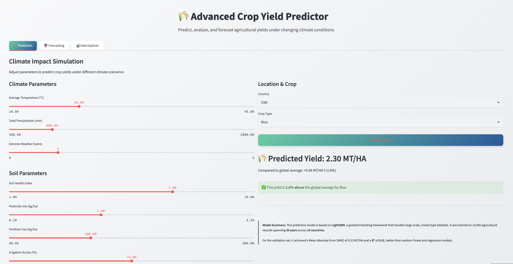
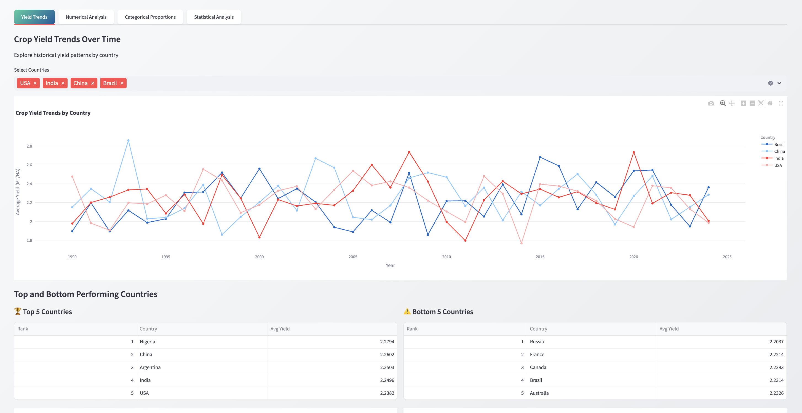

# Project Overview
# Crop Yield Predictor

Predicting crop yields across 10 countries using LightGBM for initial prediction and ARIMA for 25-year forecasting.
---
## Overview

- Utilizes **10,000 observation points** with multi-country data.
- **LightGBM** models complex, non-linear relationships for accurate crop yield predictions.
- **ARIMA** forecasts long-term yield trends for 25 years based on LightGBM outputs.
- Combines machine learning and statistical time series methods for robust, interpretable results.

---
## Setup

```bash
git clone https://github.com/Sujan-Bhattarai12/crop_yield_predictor.git
cd crop_yield_predictor
python3 -m venv venv
source venv/bin/activate  # Windows: venv\Scripts\activate
pip install -r requirements.txt

## Glimpse of an output




