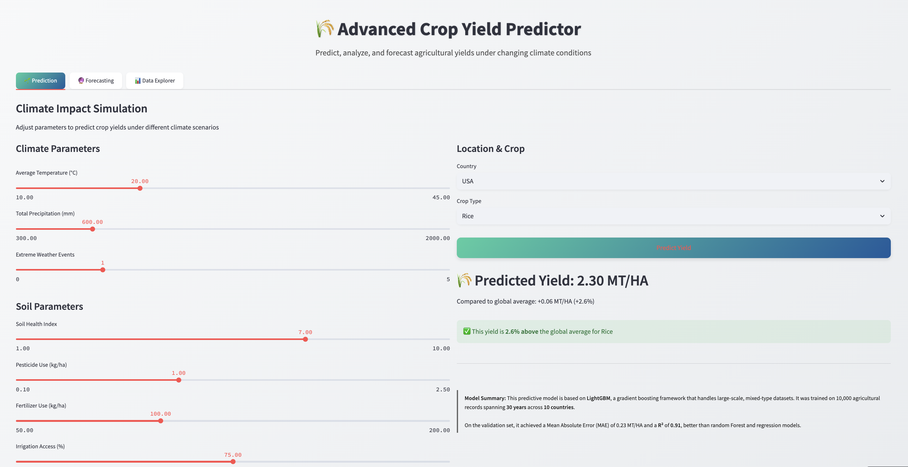
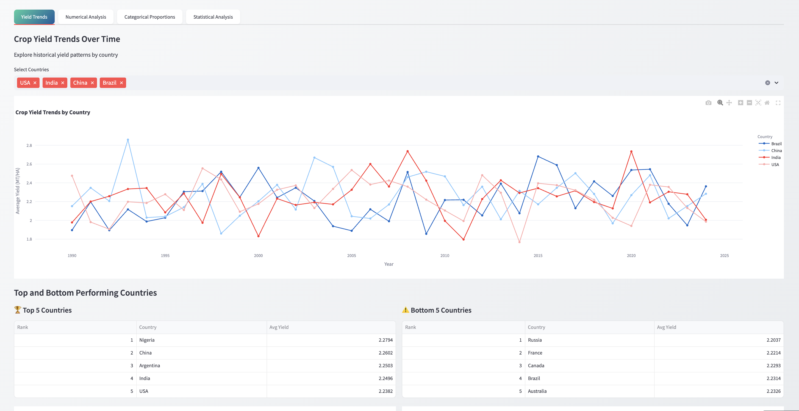

# Crop Yield Predictor

Predicting crop yields across 10 countries using LightGBM for initial prediction and ARIMA for 25-year forecasting.
---
## Overview

- Utilizes **10,000 observation points** with multi-country data.
- Used **LightGBM** models for non-linear relationships for accurate crop yield predictions.
- Integrated **Propensity matching** to isolate the impact of temperature along on the outcome
- **ARIMA** forecasts long-term yield trends for 25 years based on LightGBM outputs

---
## Glimpse of an output

